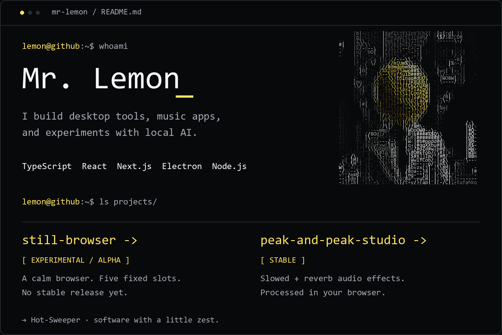

<picture>
  <source media="(max-width: 600px)" srcset="assets/profile-mobile.png">
  
</picture>

**[Still Browser · Experimental alpha](https://github.com/Hot-Sweeper/still-browser)** &nbsp; · &nbsp; **[Peak & Peak Studio · Stable](https://github.com/Hot-Sweeper/peak-and-peak-studio)**

About me and my projects

### Mr. Lemon / Hot-Sweeper

I build desktop tools, music apps, and experiments with local AI.

**Tools:** TypeScript, React, Next.js, Electron, and Node.js.

- **[Still Browser](https://github.com/Hot-Sweeper/still-browser)** — a calm browser with five fixed browsing slots. **Experimental alpha; no stable release yet.**
- **[Peak & Peak Studio](https://github.com/Hot-Sweeper/peak-and-peak-studio)** — a **stable** browser audio studio for slowed playback, reverb, and other effects. Audio is processed on your device.

The lemon artwork uses my colored ASCII generator. [Branding notes](BRANDING.md).

