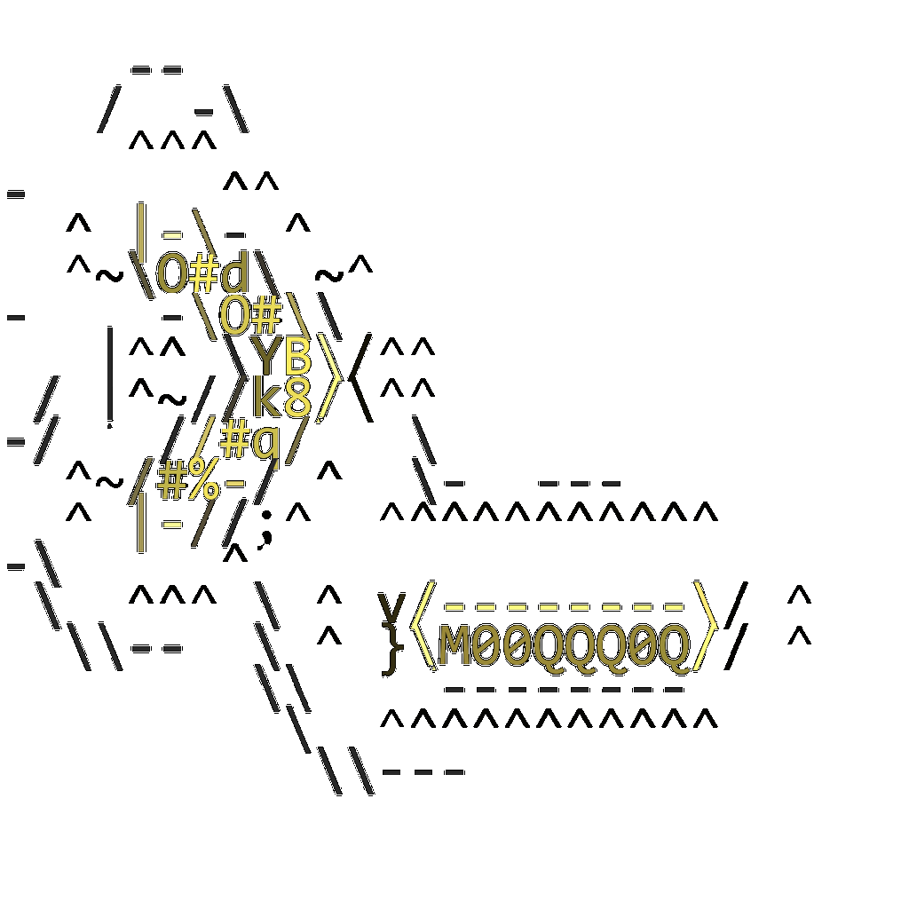
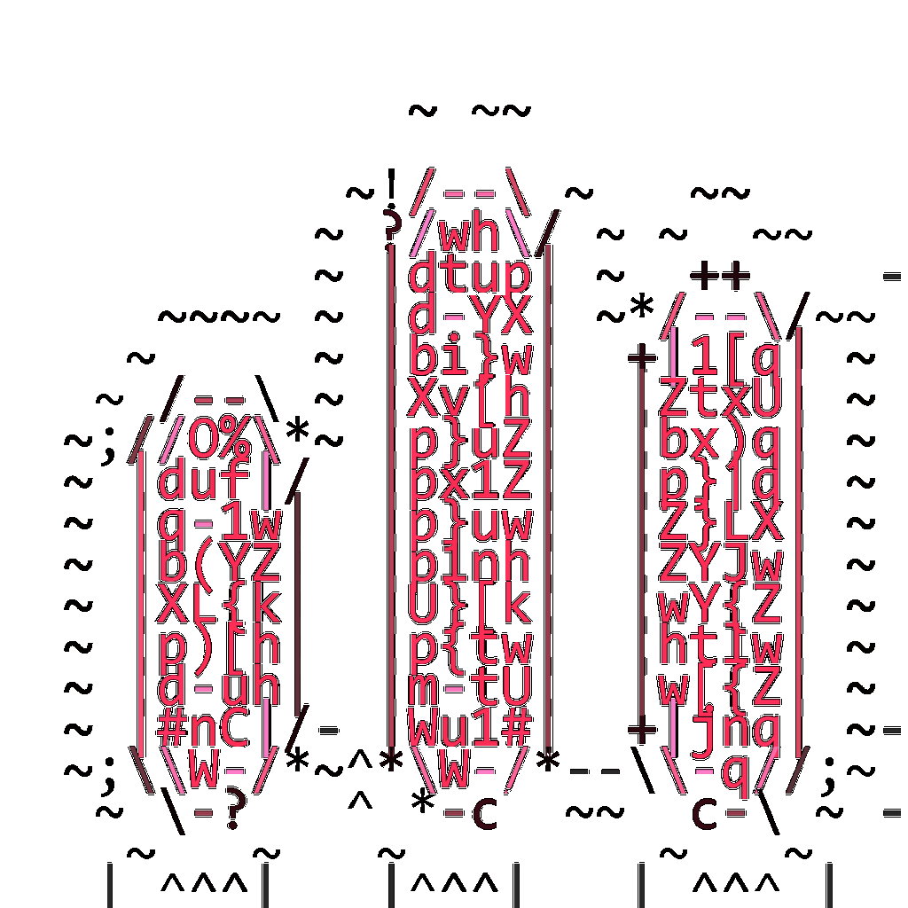

  

<h1 align="center">Mr. Lemon_</h1>

<samp>software with a little zest.</samp>

  Local AI. Real-time voice. Tools for a calmer day.

  <samp>TypeScript · React · Next.js · Electron · Node.js</samp>

## <samp>~/about</samp>

I love building with AI, especially **local models and real-time voice pipelines**. I'm happiest turning an idea into something I can use every day.

My side projects help me **stay focused, simplify everyday life, and automate repetitive work**—including YouTube channel workflows. Sometimes it's a useful tool. Sometimes it's an experiment I just had to try.

## <samp>~/projects</samp>

### [<samp>Still Browser</samp>](https://github.com/Hot-Sweeper/still-browser)

<strong>EXPERIMENTAL / ALPHA</strong> · No stable release yet.

A calmer browser built around **five fixed slots**. Keep a small working set visible instead of collecting more tabs.

[Try an alpha build →](https://github.com/Hot-Sweeper/still-browser/releases) &nbsp; [Read the docs](https://github.com/Hot-Sweeper/still-browser#readme)

 

---

### [<samp>Peak &amp; Peak Studio</samp>](https://github.com/Hot-Sweeper/peak-and-peak-studio)

<strong>STABLE</strong> · Browser audio studio.

**Slowed playback, reverb, and a little more bass.** Shape a track and export it on your device. Your audio stays in your browser.

[Explore the studio →](https://github.com/Hot-Sweeper/peak-and-peak-studio#readme) &nbsp; [Run it locally](https://github.com/Hot-Sweeper/peak-and-peak-studio#run-locally)

 

---

## <samp>~/setup</samp>

- **Current OS:** CachyOS Linux (Arch-based).
- **Coding agent:** Codex.
- **Local AI tools:** ComfyUI · LM Studio.
- **Models I use:** [Qwen3.8-27B](https://huggingface.co/Qwen/Qwen3.8-27B) · [Qwen3.8-Flash-Next](https://huggingface.co/Qwen/Qwen3.8-Flash-Next).

---

<samp>built by Hot-Sweeper · signed, Mr. Lemon</samp>

